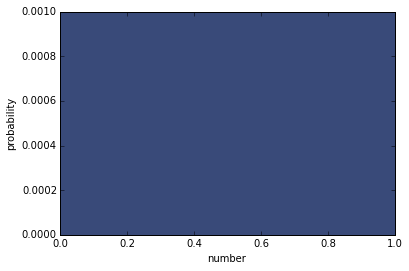
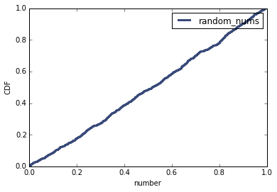
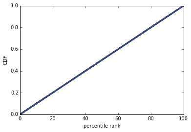

[Think Stats Chapter 4 Exercise 2](http://greenteapress.com/thinkstats2/html/thinkstats2005.html#toc41) (a random distribution)

The numbers generated by <tt>random.random</tt> are supposed to be uniform between 0 and 1; that is, every value in the range should have the same probability.

Generate 1000 numbers from <tt>random.random</tt>

```python
%matplotlib inline

import random
import thinkstats2
import thinkplot

random_nums = []
for i in range(1000):
    random_nums.append(random.random())
```

Plot their PMF

```python
pmf = thinkstats2.Pmf(random_nums)

thinkplot.Pmfs([pmf])
thinkplot.Show(xlabel = 'number', ylabel = 'probability')
```



As we expected, every value in the range has the same probability of occuring, a probablity of 0.1%, or 1 in 1000. This makes sense, since we generated 1000 numbers. I would expect that if we had generated 100 numbers, they should each have a 1% probability of occuring.

Plot their CDF

```python
cdf = thinkstats2.Cdf(random_nums, label = 'random_nums')

thinkplot.Cdf(cdf)
thinkplot.Show(xlabel = 'number', ylabel = 'CDF')
```



The plot is nearly a straight line, indicating a linear relationship.

Plot CDF of their percentile ranks

```python
ranks = [cdf.PercentileRank(x) for x in random_nums]

rank_cdf = thinkstats2.Cdf(ranks)
thinkplot.Cdf(rank_cdf)
thinkplot.Show(xlabel = 'percentile rank', ylabel = 'CDF')
```



Plotting a CDF of percentile ranks forms a straight line, indicating that the distribution is uniform.
