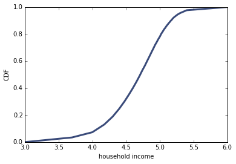

[Think Stats Chapter 6 Exercise 1](http://greenteapress.com/thinkstats2/html/thinkstats2007.html#toc60) (household income)

The distribution of income is famously skewed to the right. In this exercise, we’ll measure how strong that skew is.

...

<tt>InterpolateSample</tt> generates a pseudo-sample; that is, a sample of household incomes that yields the same number of respondents in each range as the actual data. It assumes that incomes in each range are equally spaced on a log10 scale.

Compute the median, mean, skewness and Pearson’s skewness of the resulting sample. What fraction of households reports a taxable income below the mean? How do the results depend on the assumed upper bound?

Import modules and run sample code:

```python
%matplotlib inline

import hinc2
import hinc
import thinkstats2
import thinkplot
import density
import numpy as np

hinc2.main()
```



Read in data frame and calculate summary statistics:

```python
df = hinc.ReadData()

log_sample = hinc2.InterpolateSample(df)
sample = np.power(10, log_sample)
mean, median = density.Summarize(sample)
```

Summary:<br>
mean 74278.7075312<br>
std 93946.9299635<br>
median 51226.4544789<br>
skewness 4.94992024443<br>
pearson skewness 0.736125801914<br>

Graph the PDF

```python
pdf = thinkstats2.EstimatedPdf(sample, label='income')
thinkplot.Pdf(pdf)
```


Calculate summary statistics with a higher upper bound:

```python
log_sample2 = hinc2.InterpolateSample(df, 7.0)
sample2 = np.power(10, log_sample2)
mean, median = density.Summarize(sample2)
```

Summary:<br>
mean 124267.397222<br>
std 559608.501374<br>
median 51226.4544789<br>
skewness 11.6036902675<br>
pearson skewness 0.391564509277<br>

