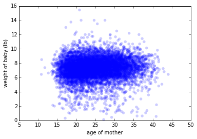
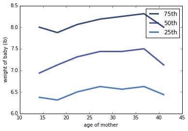

[Think Stats Chapter 7 Exercise 1](http://greenteapress.com/thinkstats2/html/thinkstats2008.html#toc70) (weight vs. age)

Using data from the NSFG, make a scatter plot of birth weight versus mother’s age. Plot percentiles of birth weight versus mother’s age. Compute Pearson’s and Spearman’s correlations. How would you characterize the relationship between these variables?

Import modules and data:

```python
%matplotlib inline

import nsfg
import thinkstats2
import thinkplot
import numpy as np

preg = nsfg.ReadFemPreg()
df = preg[preg.outcome == 1]
df = df.dropna(subset = ['totalwgt_lb', 'agepreg'])

wgt = df.totalwgt_lb
age = df.agepreg
```

Create a scatterplot of age and weight:

```python
thinkplot.Scatter(age, wgt)
thinkplot.Show(xlabel = 'age of mother',
               ylabel = 'weight of baby (lb)', 
               axis = [5, 50, 0, 16])
```



Bin the age variable and plot percentiles of weight:

```python
bins = np.arange(10, 45, 5)
indices = np.digitize(df.agepreg, bins)
groups = df.groupby(indices)

ages = [group.agepreg.mean() for i, group in groups]
cdfs = [thinkstats2.Cdf(group.totalwgt_lb) for i, group in groups]

for percent in [75, 50, 25]:
    weights = [cdf.Percentile(percent) for cdf in cdfs]
    label = '%dth' % percent
    thinkplot.Plot(ages, weights, label=label)
thinkplot.Show(xlabel = 'age of mother', ylabel = 'weight of baby (lb)')
```



Calculate Pearson's and Spearman's Correlation:

```python
p_corr = thinkstats2.Corr(age, wgt)
s_corr = thinkstats2.SpearmanCorr(age, wgt)

print "Pearson's Corr: %f" % p_corr
print "Spearman's Corr: %f" % s_corr
```

Pearson's Corr: 0.068834<br>
Spearman's Corr: 0.094610

Both Pearson's and Spearman's correlation are close to 0, indicating very little correlation between a mother's age and her child's weight at birth. However, Spearman's correlation is slightly further from 0, indicating that this data is being affected by outliers. The initial scatterplot does show various outliers, while the bulk of observations cluster between 6 and 10 lbs for nearly every age. When plotting the weights as percentiles, the weight of babies at birth increases slightly for each percentile between about age 18 up to about age 37 for mothers, then begins to drop as mothers enter their 40s. The increase is small, less than half a pound, but this relationship was not visible in the initial scatterplot.
