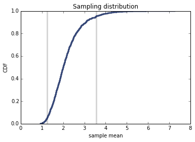
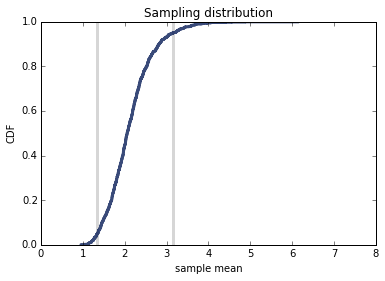
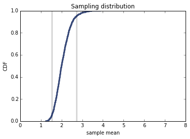
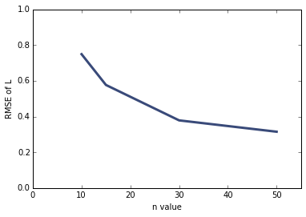

[Think Stats Chapter 8 Exercise 2](http://greenteapress.com/thinkstats2/html/thinkstats2009.html#toc77) (sampling distribution)

Suppose you draw a sample with size n=10 from an exponential distribution with λ=2. Simulate this experiment 1000 times and plot the sampling distribution of the estimate L. Compute the standard error of the estimate and the 90% confidence interval.

Repeat the experiment with a few different values of n and make a plot of standard error versus n.

Import modules:

```python
%matplotlib inline

import thinkstats2
import thinkplot
import math
import random
import numpy as np
import estimation
```

Run estimations of exponential distributions:

```python
estimation.Estimate3(10, 1000)
```

OUTPUT:<br>
Experiment 3<br>
rmse L 0.837245962958<br>
rmse Lm 1.10416146817<br>
mean error L 0.219357453804<br>
mean error Lm 0.209722895894

Create a mashup function combining <tt>Estimate3</tt> and <tt>SimulateSample</tt> to plot the distribution:

```python
def PlotEstimate(n=10, m=1000):    
    def VertLine(x, y=1):
        thinkplot.Plot([x, x], [0, y], color='0.8', linewidth=3)

    lam = 2
    means = []
    medians = []
    for _ in range(m):
        xs = np.random.exponential(1.0/lam, n)
        L = 1 / np.mean(xs)
        Lm = math.log(2) / thinkstats2.Median(xs)
        means.append(L)
        medians.append(Lm)
        
    cdf = thinkstats2.Cdf(means)
    ci = cdf.Percentile(5), cdf.Percentile(95)
    VertLine(ci[0])
    VertLine(ci[1])
    print "Confidence Interval: %f, %f" % ci
    print 'RMSE L:', estimation.RMSE(means, lam)
    print 'RMSE Lm:', estimation.RMSE(medians, lam)
    print 'Mean error L:', estimation.MeanError(means, lam)
    print 'Mean error Lm:', estimation.MeanError(medians, lam)

    # plot the CDF
    thinkplot.Cdf(cdf)
    thinkplot.Show(root='estimation1',
                   xlabel='sample mean',
                   ylabel='CDF',
                   title='Sampling distribution', 
                   axis=[0, 8, 0, 1])

PlotEstimate()
```

OUTPUT:<br>
Confidence Interval: 1.252269, 3.555544<br>
RMSE L: 0.748889560039<br>
RMSE Lm: 1.41772892967<br>
Mean error L: 0.145786521651<br>
Mean error Lm: 0.512520128718



The output is slightly different than when initially running <tt>estimation.Estimate3</tt> because <tt>random</tt> has created a different sample.

Now run the estimation again with a few different values for n:

```python
PlotEstimate(15, 1000)
```

OUTPUT:<br>
Confidence Interval: 1.347715, 3.153425<br>
RMSE L: 0.576628100935<br>
RMSE Lm: 0.874966079257<br>
Mean error L: 0.129647390296<br>
Mean error Lm: 0.184845308891



```python
PlotEstimate(30, 1000)
```

OUTPUT:<br>
Confidence Interval: 1.524308, 2.723738<br>
RMSE L: 0.378493783041<br>
RMSE Lm: 0.630125034564<br>
Mean error L: 0.0521523144231<br>
Mean error Lm: 0.177868736807



```python
PlotEstimate(50, 1000)
```

OUTPUT:<br>
Confidence Interval: 1.605077, 2.625567<br>
RMSE L: 0.314981731618<br>
RMSE Lm: 0.489278593642<br>
Mean error L: 0.0490047093669<br>
Mean error Lm: 0.137680500667


I constrained the axis in <tt>PlotEstimate</tt> so that all plots would be comparable. We can see the 90% confidence interval shrinking and slope of the graph getting steeper as the value of n increases. This means that the accuracy of estimation is increasing as we increase the sample size, as one would expect.

We can see that this holds true when plotting the sample size, n, versus the RMSE of L. As the sample size increases, the RMSE decreases:

```python
RMSEs = [0.748889560039, 0.576628100935, 0.378493783041, 0.314981731618]
Ns = [10, 15, 30, 50]

thinkplot.Plot(Ns, RMSEs)
thinkplot.Show(xlabel = 'n value', 
               ylabel = 'RMSE of L', 
               axis = [0, 55, 0, 1.0])
```


