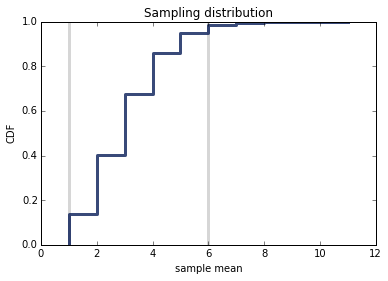
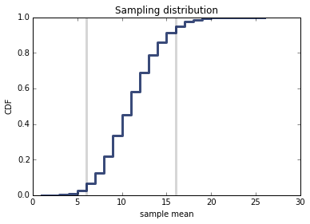
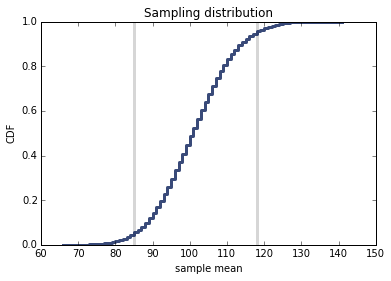
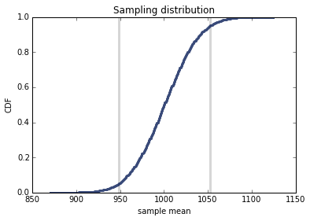

[Think Stats Chapter 8 Exercise 3](http://greenteapress.com/thinkstats2/html/thinkstats2009.html#toc77) (scoring)

In games like hockey and soccer, the time between goals is roughly exponential. So you could estimate a team’s goal-scoring rate by observing the number of goals they score in a game. This estimation process is a little different from sampling the time between goals, so let’s see how it works.

Write a function that takes a goal-scoring rate, lam, in goals per game, and simulates a game by generating the time between goals until the total time exceeds 1 game, then returns the number of goals scored.

Write another function that simulates many games, stores the estimates of lam, then computes their mean error and RMSE.

Is this way of making an estimate biased? Plot the sampling distribution of the estimates and the 90% confidence interval. What is the standard error? What happens to sampling error for increasing values of lam?

Import modules:

```python
%matplotlib inline

import thinkstats2
import thinkplot
import math
import random
import numpy as np
import estimation
```

Write a function that takes a goal-scoring rate, lam, in goals per game, and simulates a game by generating the time between goals until the total time exceeds 1 game, then returns the number of goals scored. 

There are 90 minutes in a typical soccer game, so I wrote my function to run while time is less than 90.

```python
def SimulateGame(lam):
    goals = 0
    time = 0
    while time < 90:
        goal_min = 90*(random.expovariate(lam))
        time += goal_min
        goals += 1
        
    return goals
```

Write another function that simulates many games, stores the estimates of lam, then computes their mean error and RMSE.

```python
def EstimateScores(lam=2, m=10000):
    def VertLine(x, y=1):
        thinkplot.Plot([x, x], [0, y], color='0.8', linewidth=3)

    scores = []
    for _ in range(m):
        L = SimulateGame(lam)
        scores.append(L)
        
    cdf = thinkstats2.Cdf(scores)
    ci = cdf.Percentile(5), cdf.Percentile(95)
    VertLine(ci[0])
    VertLine(ci[1])

    print "Confidence Interval: %f, %f" % ci
    print 'RMSE L:', estimation.RMSE(scores, lam)
    print 'Mean error L:', estimation.MeanError(scores, lam)
    
    # plot the CDF
    thinkplot.Cdf(cdf)
    thinkplot.Show(root='estimation1',
                   xlabel='sample mean',
                   ylabel='CDF',
                   title='Sampling distribution')
```

I ran the simulation of games with various values of <tt>lam</tt>

```python
EstimateScores(2)
```

> OUTPUT:<br>
Confidence Interval: 1.000000, 6.000000<br>
RMSE L: 1.73798734173<br>
Mean error L: 1.0074



```python
EstimateScores(10)
```

> OUTPUT:<br>
Confidence Interval: 6.000000, 16.000000<br>
RMSE L: 3.32576307033<br>
Mean error L: 1.0373



```python
EstimateScores(100)
```

> OUTPUT:<br>
Confidence Interval: 85.000000, 118.000000<br>
RMSE L: 9.9816181053<br>
Mean error L: 1.0359



```python
EstimateScores(1000)
```

> OUTPUT:<br>
Confidence Interval: 949.000000, 1053.000000<br>
RMSE L: 31.9367985246<br>
Mean error L: 0.4667



These plots are step graphs, which makes sense since they plot the goals scored in a game, and goals are whole numbers. As the value of <tt>lam</tt> increases, the size of the confidence interval grows larger, as does the RMSE of L. The increasing RMSE indicates that L is a biased estimator of lam.
